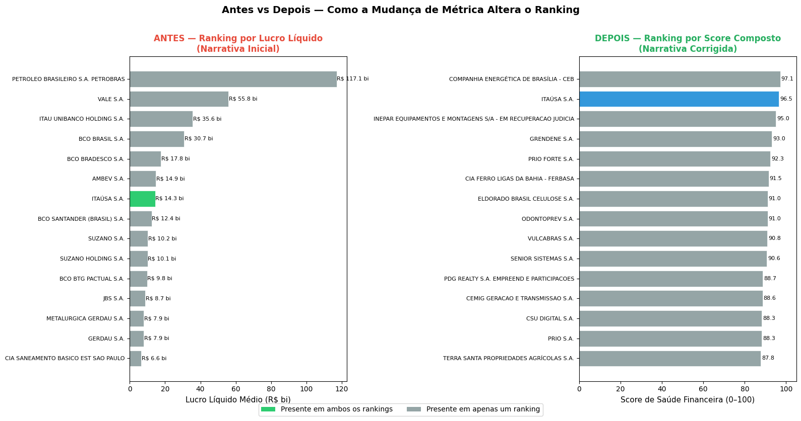

# Resumo Executivo — Narrativa Convincente vs Verdade Analítica

**Proposta 08 — Empresas Listadas (CVM)**

## Pergunta

Qual empresa está mais saudável financeiramente?

## Dados

Demonstrações Financeiras Padronizadas (DFP) de 427 companhias abertas, extraídas do [Portal de Dados Abertos da CVM](https://dados.cvm.gov.br/) — período 2022 a 2024. Foram utilizadas DRE (lucro), BPA (ativo total) e BPP (passivo e patrimônio líquido).

## Narrativa Inicial (frágil)

Ranking baseado no **lucro líquido absoluto médio**. Resultado: as empresas "mais saudáveis" seriam Petrobras, Itaú, Vale, Banco do Brasil e Bradesco — todas com lucros acima de R$ 15 bilhões/ano.

## Correções Aplicadas

- Incorporação de **3 indicadores**: Margem Líquida, ROA (Retorno sobre Ativos) e Endividamento (Dívida/PL).
- Construção de um **score composto** por percentis (0–100), com peso igual para os 3 indicadores.
- **Teste de robustez**: comparação mediana vs média por setor para validar que outliers não distorcem a conclusão.

## Narrativa Corrigida (robusta)

Refizemos o ranking usando um **score composto** baseado em Margem Líquida, ROA e Endividamento — avaliando não apenas quanto a empresa lucra, mas **como** ela lucra e **com qual risco**.

## Conclusão

A mudança de métrica **alterou 93% do ranking** (14 de 15 posições). Apenas a Itaúsa aparece em ambas as listas.

O ranking por lucro absoluto era dominado por **bancos e commodities** — Petrobras, Vale, Itaú, Banco do Brasil, Bradesco — empresas que lucram dezenas de bilhões por ano em termos absolutos. Porém, ao avaliar margem líquida, retorno sobre ativos e endividamento, essas empresas não se destacam: operam com margens proporcionalmente menores, retorno inferior sobre seus ativos e, em muitos casos, alavancagem elevada.

Ao aplicar o score composto, emergiram empresas de médio porte com operações mais eficientes e estrutura de capital mais conservadora:

- **Saíram do Top 15:** grandes bancos, petroleiras e empresas de commodities — dominantes em lucro absoluto, mas que não operam com eficiência superior nem com baixo risco de endividamento.

- **Entraram no Top 15:** empresas de médio porte com alta margem líquida, bom retorno sobre ativos e baixo endividamento relativo.

**Por que isso acontece?** Lucro absoluto favorece empresas grandes por natureza. Uma empresa com receita de R$ 500 bilhões e margem de 5% lucra R$ 25 bilhões — mais que uma empresa com receita de R$ 2 bilhões e margem de 25% (lucro de R$ 500 milhões). Mas a segunda é proporcionalmente mais eficiente e provavelmente menos vulnerável a crises.

**Conclusão:** Lucro alto não é sinônimo de saúde financeira. A escolha da métrica define a narrativa — e a decisão.

## Recomendação

Utilizar indicadores compostos (margem, ROA, endividamento) — e não lucro isolado — para decisões de investimento, análise de crédito ou avaliação de desempenho corporativo.

---

**Fonte:** [dados.cvm.gov.br](https://dados.cvm.gov.br/) | **Período:** 2022–2024 | **Empresas analisadas:** 427
